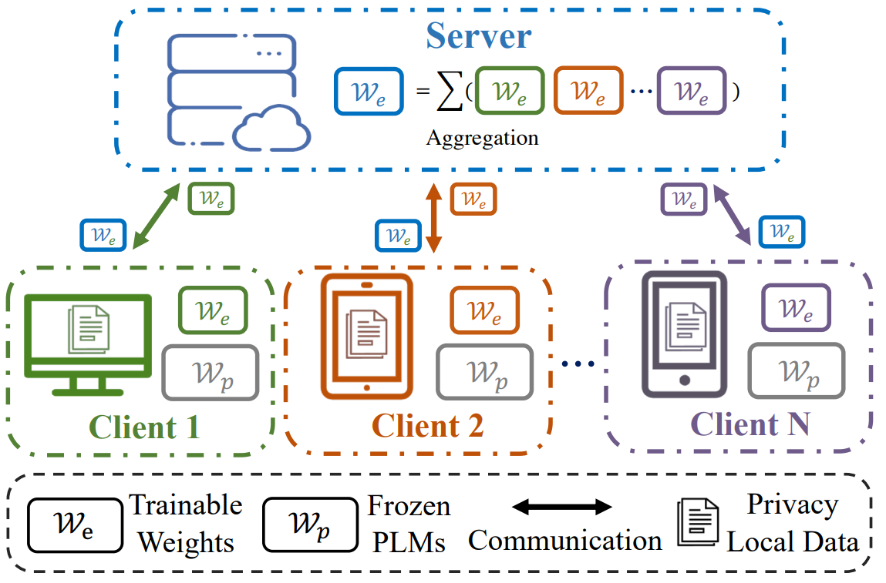

# When Federated Learning Meets Pre-trained Language Models' Parameter-Efficient Tuning Methods [[paper](https://arxiv.org/abs/2212.10025)]
<p align="center">

</p>

## Abstract

With increasing concerns about data privacy, there is an increasing necessity of fine-tuning pre-trained language models (PLMs) for adapting to downstream tasks located in end-user devices or local clients without transmitting data to the central server. This urgent necessity therefore calls the research of investigating federated learning (FL) for PLMs. However, large PLMs bring the curse of prohibitive communication overhead and local model adaptation costs for the FL system. To this end, we investigate the parameter-efficient tuning (PETuning) of PLMs and develop a corresponding federated benchmark for four representative PETuning methods, dubbed FedPETuning.
Specifically, FedPETuning provides the first holistic empirical study of representative PLMs tuning methods in FL, covering privacy attacks, performance comparisons, and resource-constrained analysis. Intensive experimental results have indicated that FedPETuning can efficiently defend against privacy attacks and maintains acceptable performance with reducing heavy resource consumption.

## Folder Structure
```grapha  
├── workspace  
│   └── data  
|   |   └── fedglue    
│   ├── pretrained  
│   │   └── nlp  
│   ├── output  
│   └── code  
│       └── FedETuning  
```  

This repo should be cloned into FedETuning:

```bash  
mkdir workspace  
cd workspace  
mkdir data  
mkdir code  
mkdir pretrain  
cd pretrain 
mkdir nlp  
cd ..  
cd code
git clone https://github.com/SMILELab-FL/FedPETuning.git FedETuning
```  

## Usage

### Setup
```bash
pip install -r requirements
```

### Data Preparation
We have provided Datasets and Pretrained Models [here](https://drive.google.com/drive/folders/14w_H7K8SU8dgZJZN2bK4e4s06QD28GU5?usp=sharing). Unzip these files and move them to ```data``` and ```pretrain/nlp``` respectively.

### Reproduce our results

To reproduce the results from our research. We recommend using:

```
python fed_seed_run.py /data/yuanhang/workspace fedavg {Task_name} {Tuning_type} {Port} {GPUS}
```

1. Task_name: rte, mrpc, sst-2, qnli, qqp, mnli
2. Tuning_type: fine-tuning, prefix, bitfit, lora, adapter.
3. Port: arbitrary port.
4. GPUS: Support any number of GPUs. Running on one gpu: 0; Runing on multi-GPU: 0,1,3.

### Usage
Run `fedavg`:
```bash
bash fed_run.sh {your_file_path}/workspace {task_name} fedavg 10001 {server_gpu_id} {client1_gpu_id} {client2_gpu_id}
```

Run `centralized`:
```bash
bash cen_run.sh {your_file_path}/workspace {task_name} centralized 10001 {server_gpu_id}
```

Hyperparameters  in ```FedETuning/run/fedavg(centralized)/config.yaml```

## Citation

If you find FedPETuning useful or relevant to your research, please kindly cite our paper:

```bibtex
@article{Zhang2022WhenFL,
  title={When Federated Learning Meets Pre-trained Language Models' Parameter-Efficient Tuning Methods},
  author={Zhuo Zhang and Yuanhang Yang and Yong Dai and Lizhen Qu and Zenglin Xu},
  journal={ArXiv},
  year={2022},
}
```